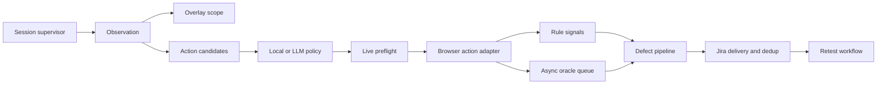

# Архитектура агента Kventin

## Цели

- непрерывно исследовать web-приложение без обязательной доступности LLM;
- выполнять только действия, валидные в текущем DOM-состоянии;
- не терять подтверждённые дефекты при временных сбоях Jira;
- создавать воспроизводимые дефекты и безопасно проводить их ретест;
- изолировать Playwright main thread от сетевых и аналитических задержек.

## Контуры



| Контур | Модули | Ответственность |
|---|---|---|
| Lifecycle | `core/supervisor.py`, `core/agent.py` | browser session, restart/backoff, orchestration |
| State | `core/agent_memory.py` | шаги, coverage, anti-loop, persistent memory |
| Observation | `core/observation.py`, `browser/page_analyzer.py` | DOM/ref snapshot, logs, candidates |
| UI state | `browser/overlay_state.py` | topmost blocking layer и проверяемое закрытие |
| Decision | `actions/action_candidates.py`, `action_policy.py`, `core/local_policy.py` | bounded candidate set и deterministic fallback |
| Execution | `actions/action_preflight.py`, `browser_actions.py`, `action_result.py` | live validation, Playwright action, единый status contract |
| Analysis | `core/post_analysis.py`, `defects/defect_signals.py` | sync rules и optional async LLM oracle |
| Delivery | `defects/defect_pipeline.py`, `jira_client.py` | evidence, reservation, dedup, idempotent create |
| Checks | `checks/scheduler.py`, `checks/agent_checks.py` | a11y, performance, iframe, responsive |
| Reporting | `core/reporting.py` | browser metrics, text/HTML/JUnit artifacts |
| Automation | `scripts/daemon.py`, `defect_retest.py`, `tasks/task_testing.py` | task testing, defect retest, periodic queue |

Декомпозиция следует идее OpenAgent/agent-skills: navigator, oracle, defect manager,
retest и artifact writer имеют отдельные роли и контракты. В runtime они реализованы
как детерминированные модули, а не как цепочка независимых LLM-агентов: так сохраняются
общий browser state, предсказуемая стоимость и возможность работать без LLM. Каталоги
`agents/`, `skills/` и `vendor/agent-skills/` используются для design-time QA-процессов.

## Инварианты

1. Playwright вызывается только из main thread. Пулы `llm`, `analysis`, `jira`, `io`
   изолированы и переиспользуются между сессиями, чтобы зависший сервис не блокировал
   другой и рестарты не размножали потоки.
2. `AgentMemory.begin_step()` вызывается один раз на orchestration step. Дополнительные
   записи (`overlay_detected`) получают тот же номер.
3. При blocking overlay кандидат и preflight разрешают действия только внутри exact
   `[data-agent-active-overlay=true]`. Отсутствующая DOM-метка приводит к fail-closed.
4. `hidden`, `inert`, `aria-hidden`, stale, disabled, outside-overlay и occluded targets
   не выполняются независимо от источника действия.
5. Закрытие overlay успешно только если исчез стабильный token прежнего topmost root.
6. Rule-based дефекты не ждут LLM. Долгий oracle хранится в bounded queue и не теряется
   при переходе к следующему шагу.
7. Дефект сначала атомарно резервируется, затем отправляется с bypass собственного
   pending-dedup. При неуспехе reservation освобождается.
8. Перед повтором Jira create выполняется поиск: это восстанавливает key после потери
   ответа и не создаёт второй тикет.
9. Ретест fail-closed: пустой, неизвестный или частично выполненный сценарий никогда
   не переводит дефект в Fixed и не возвращает его разработчику как воспроизведённый.
   Inconclusive-сценарий остаётся в QA с идемпотентным маркером, инфраструктурный сбой
   остаётся в очереди для повтора.
10. Задача получает отдельный bounded exploratory-прогон. XML публикуется только атомарно,
    после обязательного Coverage Gate и с hash текущих требований для строгого cache reuse.

## Деградация и восстановление

| Сбой | Поведение |
|---|---|
| LLM `429`/временный `5xx`/timeout | bounded retry, jitter, `Retry-After`; затем local policy |
| LLM недоступна долго | circuit breaker; Playwright и rule signals продолжают работу |
| Jira временно недоступна | отдельный retry budget; reservation release после финального сбоя |
| Ответ Jira create потерян | duplicate search возвращает уже созданный issue key |
| Browser/page закрыты | supervisor запускает новую session с bounded backoff |
| Oracle выполняется долго | future остаётся в очереди; sync rules уже отработали |
| Очередь oracle заполнена | новый optional oracle не запускается, основной цикл не блокируется |
| Сценарий ретеста неполон | задача остаётся в QA; один комментарий просит ручную проверку |
| Требования задачи изменились | cached XML отклоняется по source digest и генерируется заново |
| Daemon остановлен сигналом | текущий item завершается, interruptible sleep прекращается |
| Второй daemon | atomic lock не позволяет параллельную обработку очереди |

## Проверка изменений

```bash
python -m pytest -q
KVENTIN_RUN_BROWSER_TESTS=1 python -m pytest -q tests/test_overlay_browser_integration.py
python -m compileall -q agent scripts tests config.py
```

Browser suite запускается отдельно, потому что требует установленный Chromium/Chrome.
Она проверяет `aria-hidden + inert` фон, scope sidebar, подтверждаемое закрытие и
визуальный перехват клика через `elementFromPoint`.
